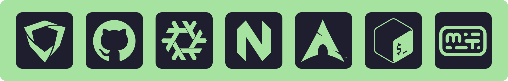

  

# 
💜 I'm a minimalist developer who types fast

<!-- Streak card: 

  

 -->

<!-- Cards: https://bentos.jkominovic.dev/ -->

  
  
  
  
  <!--  -->

# 
🛠 4 tools I trust

  
  <!--  -->
  
  
  

# 
🔥 Supporters who make this possible

  

